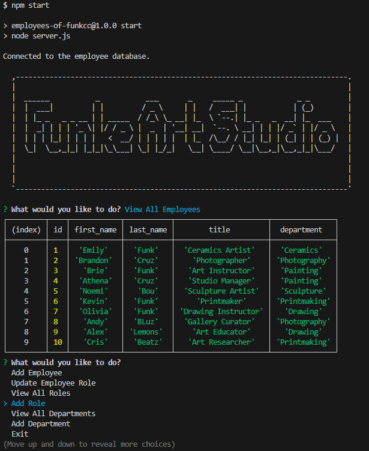

# Employees of Funk.co

## Description

Welcome to Funk.co, where we prioritize the organization and cleanliness of our employee database. Our project revolves around the utilization of SQL, enabling seamless updates to our employee database. This application streamlines company operations, ensuring that crucial databases are effortlessly accessible to both employees and managers.

### Key Features:

- Simplified Employee Database: Effortlessly manage employee records through our user-friendly application.
- Smooth Company Operations: Our application optimizes workflows, promoting efficiency and reducing potential complications.
- Seamless Accessibility: Vital databases are at your fingertips, enhancing accessibility for both employees and managers.

Through this project, I gained valuable insights into connecting the server.js with schema files, enabling seamless access and interactions with databases. Our commitment to an organized and efficient employee database remains unwavering.

Thank you for choosing Funk.co for your employee database needs. We look forward to delivering enhanced organization and efficiency to your company's processes.

## Table of Contents

- [Installation](#installation)
- [Usage Instruction](#usage-instruction)
- [Walkthrough Video:](#walkthrough-video)
- [GitHub Repository](#github-repository)
- [Screenshot](#screenshot)
- [Built With](#built-with)
- [Credits](#credits)
- [License](#license)
- [Badges](#badges)
- [Contribute](#how-to-contribute)
- [Tests](#tests)
- [Questions](#questions)

## Installation

To get started with our application, follow these steps:

1. **Clone the Repository from GitHub:** Alternatively, you can download the ZIP folder from the repository's GitHub page.
```bash
git clone https://github.com/4funke/Employees-of-funk.co.git
```
2. **Open the Repository in a Source Code Editor:**
Open your preferred source code editor (e.g., Visual Studio Code, Sublime Text) and navigate to the cloned repository's directory.

### Additional Resources
- [Walkthrough Video:](#walkthrough-video) Check out a live demo of our application
- [GitHub Repository:](#github-repository) For more details and to explore the code

## Usage Instruction: 
#### Follow these steps to effectively utilize our application:
1. **Open the Integrated Terminal:** Navigate to the location of the server.js file within the cloned repository and open your integrated terminal.
2. **Log into Your MySQL Account:** Ensure you are logged into your MySQL account before proceeding with the following steps. This will enable smooth interaction with the database.
3. **Import Schema and Seeds:** Run the following command to initialize your database schema and populate it with initial data:
```bash
mysql -u your-username -p < db/schema.sql 
```
4. **Install Dependencies:** Install project dependencies using the following command:
```bash
npm install 
```
5. **Start the Application:** Start the application by running the following command:
```bash
npm start 
```
6. **Interact with the Database:** After successfully starting the application, you'll be able to interact with the database. You can view, add, or update employees' records as needed.

By following these steps, you'll be seamlessly connected to the database and can efficiently manage employee data. Feel free to explore the various functionalities and enjoy an enhanced organizational experience.

## Walkthrough Video:
[Walkthrough Video]()

## GitHub Repository:
[GitHub Repository](https://github.com/4FunkE/Employees-of-funk.co)

## Screenshot


## Built With:
This project was developed using the following technologies and tools:
- [JSON](https://www.npmjs.com/package/json)
- [Node.js](https://nodejs.org/en/blog/release/v16.18.1/)
- [Dotenv](https://www.npmjs.com/package/dotenv)
- [Express](https://www.npmjs.com/package/express)
- [Node MySql2](https://www.npmjs.com/package/mysql2)
- [Inquirer](https://www.npmjs.com/package/inquirer/v/8.2.4)
- [Visual Studio Code](https://code.visualstudio.com/)
### Technologies and Tools Overview
- JSON: Used for data representation and exchange.
- Node.js: The runtime environment for executing JavaScript code on the server.
- Dotenv:  Enables the usage of environment variables to manage configuration.
- Express: A fast and minimal web application framework for Node.js.
- Node MySql2: A MySQL driver for Node.js.
- Inquirer: Facilitates user interactions in the command-line interface.
- Visual Studio Code: The integrated development environment used for coding.

## Credits

Collaborators: 
- AskBCS Learning Assistants
- Andrew Bautista-Instructor
- Will-TA

## License

This application is covered under the MIT license. [](https://opensource.org/licenses/MIT)

## Badges


## Features

Discover the functionalities and capabilities of our application:

- View Employees: Access a comprehensive list of all employees, complete with their details.
- Add Employee: Seamlessly add new employees to the database, ensuring accurate records.
- Update Employee: Effortlessly modify existing employee information as needed.
- View Roles: Explore a catalog of available roles within the company hierarchy.
- Add Role: Intuitively introduce new roles to the system, tailored to your company's structure.
- View Departments: Gain insights into various company departments through a comprehensive overview.
- Add Department: Efficiently create new departments to match your organizational needs.

Our application empowers you with these features, streamlining employee database management and optimizing company operations. Experience enhanced efficiency and organization with every interaction.

## How to Contribute

We welcome contributions to enhance and improve our project. Whether you're interested in fixing a bug, implementing new features, or enhancing documentation, your contributions are highly appreciated.

To contribute to our project, follow these steps:

1. Fork the Repository: Fork our repository to your own GitHub account by clicking the "Fork" button.
2. Clone the Repository: Clone the forked repository to your local machine using:
```bash
git clone https://github.com/4funke/Employees-of-funk.co.git 
```
3. Create a New Branch: Create a new branch to work on your contribution using:
```bash
git checkout -b your-feature-branch 
```
4. Make Changes: Make your desired changes or additions to the codebase.
5. Test Your Changes: Test your changes thoroughly to ensure they work as expected.
6. Commit Your Changes: Commit your changes with a clear and concise commit message:
```bash
git commit -m "Add: Brief description of your changes" 
```
7. Push to Your Fork: Push your changes to your forked repository:
```bash
git push origin your-feature-branch 
```
8. Open a Pull Request: Open a pull request from your feature branch to our main repository. Provide a clear title and description for your pull request, outlining the changes you've made.
9. Review and Feedback: Participate in the discussion, address any feedback, and iterate on your changes as needed.

By following these steps, you contribute to the growth and enhancement of our project. We value your time and effort, and your contributions will make a positive impact.

If you're unsure about where to start or need assistance at any point, feel free to reach out. Together, we can make our project even better!

## Tests

n/a

## Questions
If you have any questions or need further assistance, feel free to reach out. You can contact me through my [GitHub profile](https://github.com/4FunkE) or via email at 4funkecodes@gmail.com. I'm here to help and support you in any way I can. Have a funke day!